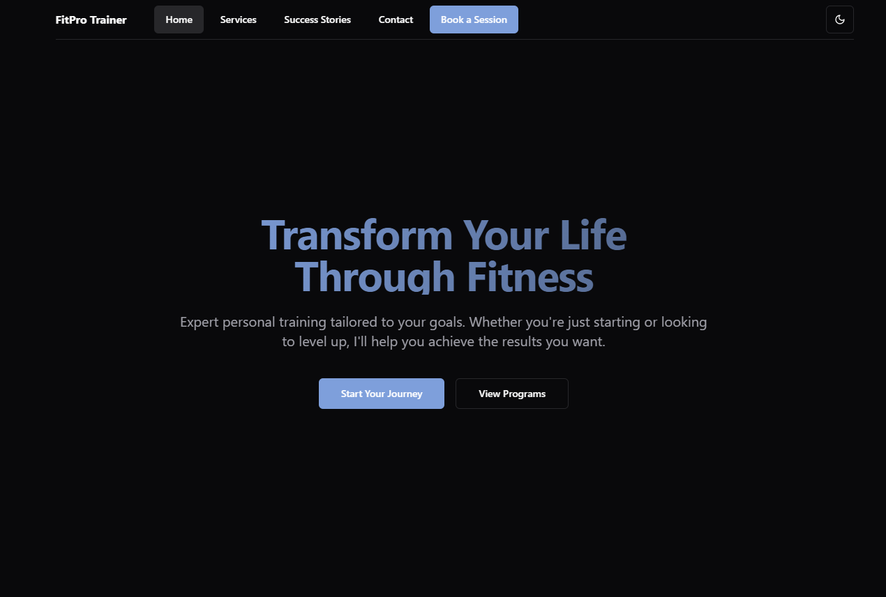

## Preview
[](https://personal-trainer-portfolio.vercel.app/)

# Personal Trainer Portfolio Website
A modern, responsive personal trainer portfolio website built with React, Tailwind CSS, and Express.
## Features
- Responsive design for all devices
- Dark mode support
- Service showcasing
- Testimonials carousel
- BMI Calculator
- Booking system
- Contact form
- Success stories gallery
## Local Development Setup
### Prerequisites
- Node.js (v20 or later)
- npm (comes with Node.js)
### Installation Steps
1. Clone or download the repository to your local machine
2. Install dependencies:
```bash
npm install
```
4. Start the development server:
```bash
npm run dev
```
The application will start on `http://localhost:5000`
### Project Structure
- `/client` - Frontend React application
  - `/src/components` - Reusable React components
  - `/src/pages` - Page components
  - `/src/hooks` - Custom React hooks
- `/server` - Backend Express server
- `/shared` - Shared types and schemas
## Available Scripts
- `npm run dev` - Start development server
- `npm run build` - Build for production
- `npm start` - Start production server
- `npm run check` - Type checking
## Technologies Used
- React
- TypeScript
- Tailwind CSS
- Express
- shadcn/ui
- Framer Motion
- React Query
- wouter (for routing)